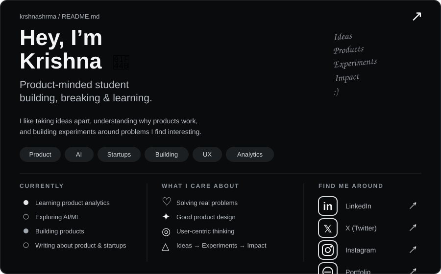

 

<a href="https://www.linkedin.com/in/krshnashxrma/">
  LinkedIn
</a>
&nbsp;&nbsp;•&nbsp;&nbsp;

<a href="https://x.com/krshnashxrma">
  X
</a>
&nbsp;&nbsp;•&nbsp;&nbsp;

<a href="https://www.instagram.com/krshnashxrma/">
  Instagram
</a>
&nbsp;&nbsp;•&nbsp;&nbsp;

<a href="YOUR_PORTFOLIO_URL">
  Portfolio
</a>

